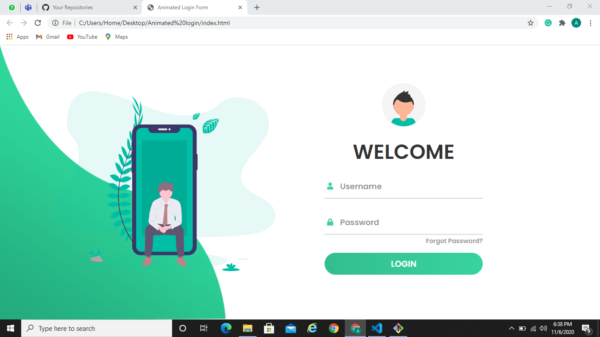
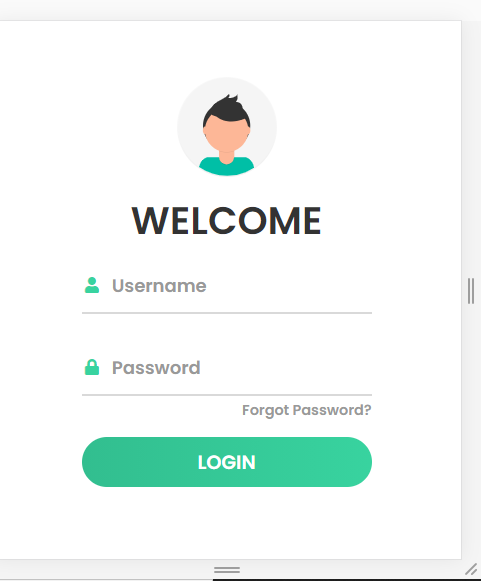

## Animated Login Page

Designed a Responsive Animated login page using HTML, CSS, Bootstrap and JavaScript.

### Webview

### Mobile view 

## Implementation

- The home page consists of a form that requires user to input their credentials. 

- The username and password sections respond to clicks by the user.

- The elements of the page adjust themselves according to the width of the device on which they are being accessed.

## Instructions

- Just open the index.html file.

## Technologies used 

- HTML
- CSS
- Bootstrap
- JavaScript